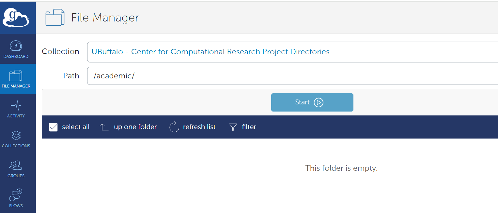
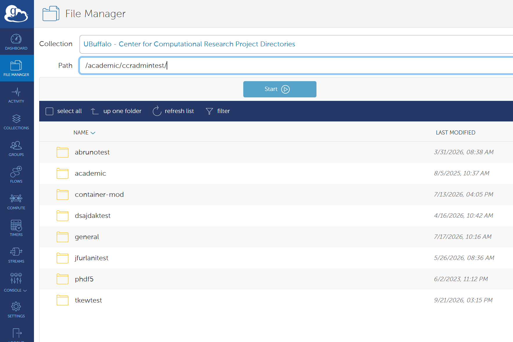
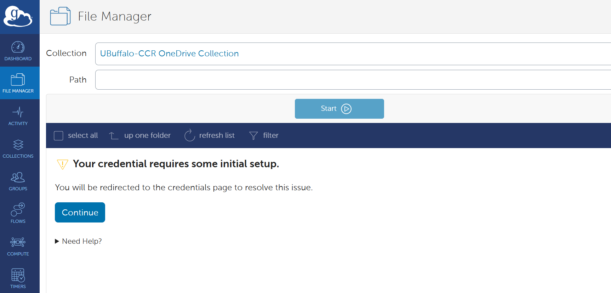
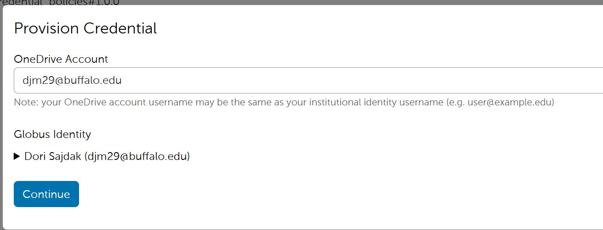

# Data Transfer


CCR supports multiple ways to transfer Data in and out of CCR and the method 
you choose depends on the amount of Data to transfer and the speed of your connection to CCR.
File transfers from a local system can be done through a web-based
application called _Globus_ or through command-line tools such as
secure copy (_scp_), secure ftp (_sftp_) and _rsync_. Some
command-line tools may be unavailable on Windows, though alternative
applications exist. (e.g., Git Bash, FileZilla)


CCR Supported Methods for inbound and outbound Data transfer include:

1. **[Globus File Transfer Service](#globus-transfers)**

2. **[Secure Shell Copy (scp/sftp)](#secure-shell-copy)**

3. **[rclone](#rclone)**

4. **[OnDemand File Manager App](#ondemand-file-manager-app)**

!!! Warning "VPN Required" 
    Access to Secure Shell Copy and OnDemand is restricted to UB and Roswell Park networks (either on campus or connected to their [VPN services](../getting-access.md#vpn-access)).  Globus transfers are available from everywhere. You do not need to be on the UB or Roswell Park networks to use Globus.

Watch the virtual workshop video to learn more about data transfer options at CCR:  
  

---

## Globus transfers

Globus file transfers are typically initiated through an interactive web application (command-line access to Globus is also available, but is beyond the scope of this document). Globus addresses deficiencies in traditional file-transfer mechanisms by automating large data transfers, resuming failed transfers, distributing large transfers across multiple servers, and brokering direct transfers between remote computing centers. Globus performs an MD5-Checksum for transfer verification.

Globus can be used on macOS, Linux, and Windows operating systems and is CCR's recommended way of transferring files, especially for large amounts of data.

### Globus Web App  

To use Globus, go to the [Globus Web App](https://app.globus.org/) and sign in by selecting "The State University of New York at Buffalo" from the drop-down menu and by logging in using your UB credentials. Roswell Park users should search for "Roswell Park Comprehensive Cancer Center" and authenticate with their Roswell Park account, not their UB account.  

!!! Note "non-UB users:"
    If you are with an institution other than UB or Roswell Park, you will need to [create a Globus account](https://www.globusid.org/create) and contact [CCR Help](../help.md) to map your globusid to your CCR account.


CCR storage resources are available in Globus as mapped collections. You can connect to a CCR endpoint using the "collections" field in the Globus web interface and searching for `UBuffalo`

CCR currently has 5 Mapped Collections:

* UBuffalo - Center for Computational Research Project Directories
* UBuffalo - Center for Computational Research Home Directories
* UBuffalo - Center for Computational Research Vast Global Scratch (/vscratch)
* UBuffalo-CCR Box Collection (for accessing your UB Box account)
* UBuffalo-CCR OneDrive Collection (for accessing your Microsoft OneDrive account)

Log into the endpoint you'd like to access using your UB or RPCI account credentials (not your CCR account). The system will map your @buffalo.edu or @roswellpark.org account to your local CCR user and you will have access to the same directories that you do when logged into any other CCR system.  

NOTE: Some RPCI accounts will not automatically map correctly to CCR accounts.  If this is affecting you, please contact [CCR Help](../help.md) and we'll resolve the mapping issues.  

**Usage Notes:**  

- You can download single files through the browser but to take advantage of the benefits of Globus you will need to do endpoint to endpoint transfers. To do this, you must configure a local endpoint in order to transfer files to/from your local computer. To configure a local Globus endpoint, install the [Globus Connect Personal](https://www.globus.org/globus-connect-personal) and create a personal endpoint following the instructions relevant for your operating system.
- Using the File Manager in the [Globus web app](https://app.globus.org/), you can upload or download files between your local endpoint, CCR's endpoints, UB Box and OneDrive.  For example, to transfer between your computer and CCR's storage, on one side, connect to your local endpoint and on the other side navigate to the CCR endpoint where you've stored your files.  Select the file(s) or directory to transfer and click the transfer button.  This will initiate the transfer from one to the other.
  


- Globus transfers will run unattended and you'll receive an email when the transfer completes.
- If any interruptions occur on either end, Globus will pickup the transfer where it left off when the issue is resolved.
- When using the Globus web app, file sizes larger than 2GB will be blocked.  Please use the [Globus command line interface](https://docs.globus.org/cli/) for large file transfers.
- When accessing CCR's home directory collection, you will be automatically directed to your personal home directory
- When accessing the collections for project and vscratch directories, **you will need to enter the full path of the directory you'd like to access**.  This is demonstrated in the screenshots below.  Please see [this information](../changelogs/2026.md#july-2026-downtime) for more details on the auto-mounting of directories.
- How do I know the full path of the directories I have access to?  Your group's shared directory path can be found on your storage allocation in [ColdFront](../portals/coldfront.md).  Note: Users may have access to multiple storage allocations on multiple projects.
- Once you've navigated to a CCR collection and preferred directory, we recommend you bookmark it for faster access next time.  Click on the bookmark icon to the right of the Path field.

When descending into the `/projects/academic` subdirectory, it appears that there are no available directories.  




However, once you enter the name of the subdirectory you have access to, you will see your group's files and subdirectories:  




### Using Globus to transfer files to and from UB Box

CCR users are able to move data between CCR and UB Box within Globus using an integrated Box Connector App. Initial setup will require you to log into UB Box and give the app consent to access UB Box on your behalf.  You will also be prompted to renew the access if it's been awhile since you last connected to UB Box through Globus.  

!!! Note 
    The Box API implements rate limiting so depending on the type of transfer and number of files you may get connection resets in the transfer log. These will not stop the transfer because Globus will just retry the connection until the transfer is complete.  
    

#### Granting Access to the UBuffalo-CCR Globus Box Connector App

*These steps are only needed when accessing the UB Box Collection for the first time or when prompted to renew consent:*

Log onto the [Globus Web App](#globus-web-app)

Go to the File Manager tab and search for the "UBuffalo-CCR Box Collection" in the Collection search bar.

When you click on the UBuffalo-CCR Box Collection for the first time, you will be prompted to Authenticate to the UB Box service.


Click `Continue` and you will be directed to the "Registering a Credential" Page. 


This screen shows which Account globus will use to Connect to the CCR UB Box Collection.  
If this is all correct Click `Continue`

You will then be directed to the "Box Login Page"


Verify the account that will be used to log into UB Box is correct and Click `Authorize`

This will take you to the normal UB Single Sign On (SSO) login page where you will log in using your UB credentials and Duo 2 Factor if prompted.

After sucessfully logging into UB SSO you will be prompted with one more screen to Grant access to the "UBuffalo-CCR Globus Box Connector"


Click `Grant access to Box` and you will now be authenticated to your UB Box account from within Globus. You will then be sent back to the File manager screen.

If the panel is blank, you will need to search again for the "UBuffalo-CCR Box Collection" in the Collection search bar. If you have properly granted consent to the Globus Box App, then you should see the contents of your UB Box account.

Once you have completed the Access Consent steps above, you should now be able to access UB Box just like any of the other CCR Mapped Collections.

### Using Globus to transfer files to and from Microsoft OneDrive

CCR users are able to move data between CCR and their Microsoft OneDrive account(s) within Globus using an integrated OneDrive Connector App. Initial setup will require you to give the app consent to access OneDrive on your behalf.  You may also be prompted to renew the access if it's been awhile since you last connected to Microsoft through Globus.  


#### Granting Access to the UBuffalo-CCR Globus OneDrive Connector App 

*These steps are only needed when accessing the OneDrive Collection for the first time or when prompted to renew consent:*

Log onto the [Globus Web App](#globus-web-app)

Go to the File Manager tab and search for the "UBuffalo-CCR OneDrive Collection" in the Collection search bar.

When you attempt to access the UBuffalo-CCR OneDrive Collection for the first time, you will be prompted to setup your OneDrive credentials.  Click the Continue button to be redirected to the Credentials management page.  



Enter the email address for the OneDrive account that you'd like to connect to and click Continue.  If you haven't already authenticated to that account, you will be prompted to login.  After this completes, you can go back to the OneDrive collection and access your files.




### Globus Integration with OnDemand  

CCR users may also access Globus using the [OnDemand Files app](../portals/ood.md#files-app).


### Sharing Data on CCR's systems via Globus

CCR users can share any file or folder that they have access to on CCR's systems with anyone who has a Globus account using Guest Collections (Globus Shared Endpoints). This is particularly useful for external collaborations in which data sharing is necessary but collaborators don't need direct access to CCR's systems.  Guest collections can be set to read only mode or read and write.  This provides a mechanism for collaborators to upload data to your CCR directory as well as download data.  Please refer to the Globus documentation for detailed information on [creating Guest Collections](https://docs.globus.org/how-to/share-files/).


## Secure Shell Copy

Command line terminal access is provided via the SSH protocol, while command line file transfer 
is available with `sftp` (Secure File Transfer Protocol) and `scp` (Secure Copy).  More information on using SSH on CCR's system is on the [SSH login page](../hpc/login.md#connecting-with-ssh).   

**to/from the Frontends:**

* This would be for simple file transfers that can complete within a 15 minute timeframe  

**from the Compute Nodes:**

* This would be for file transfers that can complete within a 72 hour window (UB-HPC cluster max, Faculty cluster nodes may have longer max walltime)
* This will only work for outbound transfers because compute nodes are not exposed externally
* You must have an active job with an allocated compute node to get access to the node  

!!! Note "SSH Keys required"
    Users must use SSH keys to connect to CCR servers using SSH/SFTP/SCP.  Please [follow these instructions to upload your public SSH key](../portals/idm.md#manage-ssh-keys) to the CCR identity management portal before attempting to connect to CCR's servers.  

### Command line SCP

The Secure Copy utility, `scp`, can send data to and fetch data from a remote server.

In the examples here, replace `<path-to-file>` with the path of the file you wish to copy, `[CCRusername]` with your CCR
username, and `<target-path>` with the full path to the directory you would like to send the file to.

```bash
# Copying files from a local workstation to CCR Frontend Servers

scp -i <path-to-yourSSHKey> <path-to-file> [CCRusername]@vortex.ccr.buffalo.edu.edu:<target-path>
```

!!! Note
    For any of the SSH based transfer methods, If you are running an SSH Agent locally that manages your private key you will not need to specify the key in the command line.

Windows users can access scp through PowerShell or [Git bash](https://gitforwindows.org/) or using a GUI application like [FileZilla](#filezilla).

For more information on secure copy take a [look at some of our listed resources](#more-reading) or consult the scp manual page.

### Interactive file transfer with SFTP

The `sftp` utility is an interactive alternative to `scp` that allows multiple, bi-directional transfer operations in a single
session. Within an sftp session, a series of domain-specific file system commands can be used to navigate, move, remove, and copy data
between a local system and CCR resources.

```bash
sftp [CCRusername]@vortex.ccr.buffalo.edu
```

We can then use various commands to traverse and manipulate both local and remote file systems.

Command | Function | Example
--------|--------------------------------------------------------------------|----------
cd      | Changes the directory of the remote computer                       | cd remote_directory
lcd     | Changes the directory of the local computer                        | lcd local_directory
ls      | Lists the contents of the remote directory                         | ls
lls     | Lists the contents of the local directory                          | lls
pwd     | Prints working directory of the remote computer                    | pwd
lpwd    | Prints working directory of the local computer                     | lpwd
get     | Copies a file from the remote directory to the local directory     | get remote_file
put     | Copies a file from the local directory to the remote directory     | put local_file
exit    | Closes the connection to the remote computer and exits the program | exit
help    | Displays application information on using commands                 | help

For more information on sftp [check out some of our listed resources](#more-reading) or consult the sftp manual page.

### Rsync

While `scp` is useful for simple file copy operations, the `rsync` utility can be used to synchronize files and directories across two
locations. This can often lead to efficiencies in repeat-transfer scenarios, as rsync only copies files that are different between the
source and target locations (and can even transfer partial files when only part of a file has changed). This can be very useful in reducing
the amount of copies you may perform when synchronizing two datasets.

!!! Warning
    You will need to set the remote shell command to ssh. The default rsh is not secure and will not work at CCR.

In the examples here, replace `<path-to-file>` with the path of the file you wish to copy, `[CCRusername]` with your CCR
username, and `<target-path>` with the full path to the directory you would like to send the file to.

```bash
# Synchronizing from a local workstation to CCR

rsync -e 'ssh -i <path-to-yourSSHKey>' -r <path-to-directory> [CCRusername]@vortex.ccr.buffalo.edu:<target-path> 
```

**rsync** is not available on Windows by default, but [may be installed individually](https://www.itefix.net/cwrsync) or as part of [Windows
Subsystem for Linux (WSL)](https://docs.microsoft.com/en-us/windows/wsl/install-win10).

For more information on rsync [check out some of our listed resources](#more-reading) or consult the rsync manual page.

### Filezilla

There are additional software products available for Windows, Mac, and Linux distributions that provide secure drag and drop interfaces for file transfer such as [Filezilla](http://www.buffalo.edu/ubit/service-guides/software/downloading/windows-software/managing-your-software/filezilla.html).

Once installed, follow these steps to connect to CCR resources with Filezilla:

** Adding CCR as a site: **

!!! Note "SSH Keys Required"
    You will need the SSH Key setup in FileZilla so that it does not try and use a password. CCR will only allow SSH key authentication. 

If you are using an SSH Agent to manage your SSH Keys , Verify that your **SSH_AUTH_SOCK** environment variable has been set by the SSH Agent.

```bash
$ echo $SSH_AUTH_SOCK
/run/user/1000/keyring/ssh
```
Open the Filezilla Application

> *  From the File dropdown click `Site Manager...`
 
This will popup the Site Management Window

> * Click `New Site`
> * Rename the site from the default New Site to "CCR"

> * Enter the Following Settings:

      - Protocol: SFTP - SSH File Transfer Protocol
      - Host: vortex.ccr.buffalo.edu
      - Login Type: Normal
      - Username: [CCRusername]
      - Password: Leave Blank

> * Click `OK` to add the site.

After the Site has been added you can connect to CCR by selecting it from the Site Manager Window and clicking `Connect`

**_If you are NOT using an SSH Agent to manage your SSH Keys:_**

Open the Filezilla Application

> * From the Edit dropdown select `Settings` 
> * Go to the `SFTP` Page
> * Click `Add key file...`
> * Navigate to your CCR Private SSH Key and click `Open`

Filezilla will prompt to convert the key into a compatible format

> * Click `yes` and select a place and name for the converted key

You will now see the key in the list of SSH keys

> *  From the File dropdown click `Site Manager...`
 
This will popup the Site Management Window

> * Click `New Site`
> * Rename the site from the default New Site to "CCR"

> * Enter the Following Settings:

      - Protocol: SFTP - SSH File Transfer Protocol
      - Host: vortex.ccr.buffalo.edu
      - Login Type: keyfile
      - Username: [CCRusername]
      - Key file: Navigate to the Key you converted in previous steps

> * Click `OK` to add the site.

After the Site has been added you can connect to CCR by selecting it from the Site Manager Window and clicking `Connect`

## rclone

**rclone** is a tool that can be used to transfer files to/from cloud storage such as Microsoft OneDrive and Box from the command line. The following are instructions on how to use rclone to transfer data to/from OneDrive. For instructions with other cloud storage, check the [**rclone** Online documentation](https://rclone.org/docs/)


**rclone** is available as a [module](../software/modules.md#using-modules) at CCR and needs to be loaded in the users environment first.

!!! Note
    OneDrive requires an Internet connected web browser to obtain an authentication token from Microsoft. CCR compute nodes do not have browsers, so you will need access to a machine with [**rclone**](https://rclone.org/downloads/) and a web browser.


### Using rclone with OneDrive

```bash
$ module load rclone
```

```bash
$ rclone config

No remotes found, make a new one?
n) New remote
s) Set configuration password
q) Quit config
n/s/q> 
```

>> * answer **n** for new remote

> * "**name>**" (the name for the new remote) 
>> * Give it a name such as "OneDrive"

> * "**Storage>**" (the storage type of the new remote)
>> * Select the number that corresponds to "Microsoft OneDrive"

> * "**client_id>**" (OAuth Client Id.) 
>> *  Press Enter to leave empty.

> * "**client_secret>**" (OAuth Client Secret.)
>> *  Press Enter to leave empty.

> * "**region>**"
>> * Press Enter for the default (global).

> * "**Edit advanced config?**"
>> * Enter 'n' No (default)

> * "**Use auto config?**"
>> * Enter 'n' for machine without web browser access

You will then be prompted with the following:
```
Execute the following on the machine with the web browser (same rclone
version recommended):
	rclone authorize "onedrive"
Then paste the result.
Enter a value.
```

As mentioned in the previous Note, You will need to run the authorize command on a system that can open up a browser window which will take you through the authentication steps to access your OneDrive. This includes UB's Single Sign On system if you are a UB Faculty or Staff member.
Once those steps have been completed you can paste the token into the config_token prompt.


> * "**config_token>**"
>> * Paste the token from the authorize step above.

> * "**config_type>**"
>> * Press Enter for the default (onedrive)

> * "**config_driveid>**" (Choose drive to use )
>> *  Select the one that corresponds to OneDrive (business)

> * "**Drive OK?**"
>> * Type "**y**" to confirm the drive you wish to use is correct.

> * "**Keep this "OneDrive" remote?**"
>> * Type "**y**" for Yes this is OK (default)

For additional information on remote setup including additional options see the [rclone setup guide](https://rclone.org/remote_setup/)

!!! Error "Security Warning"
    **rclone** stores your access tokens and information about your cloud services in your configuration file. You should keep your rclone.conf file in a secure location with proper permissions set.
    As added protection, we recommend encrypting your configuration file, as per the [rclone configuration encryption guide](https://rclone.org/docs/#configuration-encryption).

To test the connection, create a file with the touch command or copy an existing file to your OneDrive

```
$ touch somefile.txt
$ rclone copy somefile.txt OneDrive:/test
```
This will copy the test file to a test directory, you can verify the copy was successful by using `rclone ls` or logging into OneDrive in a web browser 

```
$ rclone ls OneDrive:/test
0 somefile.txt
```

**Additional rclone information:**

> * [rclone Online documentation](https://rclone.org/docs/)   
> * [rclone OneDrive setup instruction](https://rclone.org/onedrive/)  
> * [rclone Box setup instruction](https://rclone.org/box/)  


## OnDemand File Manager App

This is browser based for simple transfers and not recommended for large amounts of data.  However, OnDemand offers Globus integration to make larger file transfers easier.  For more information see the [OnDemand documentation](../portals/ood.md#files-app)  


<!--
## Transferring Files with UB Box

The UB Information Technology group has recommended using ftps (secure ftp) to transfer files to/from UB Box because 
it is considerably faster than the alternatives.  To use "ftps" (i.e. ftp over SSL), CCR users can use "lftp" on a CCR 
login node (if the transfer will take less than 15 minutes), by running an interactive job or using an OnDemand desktop 
to run for longer periods of time. Prior to doing so, UB users must create an FTP password within Box.  

UBit provides documentation on [using FTP with UBbox](https://www.buffalo.edu/content/www/ubit/information-for-it-staff-pw/box/ftp.html)

Once your UBbox ftp password is setup, you can transfer files from CCR to UB Box using SFTP. 

To do this, SSH into a CCR Login node and use the following steps substituting in your information:

```bash
$ lftp
lftp :~> set ftps:initial-prot ""
lftp :~> set ftp:ssl-force true
lftp :~> set ftp:ssl-protect-data true
lftp :~> open ftps://ftp.box.com:990
lftp ftp.box.com:~> user UBID@buffalo.edu
Password: _enter_your_box_ftp_password_here_
lftp UBID@buffalo.edu@ftp.box.com:~> ls
drwx------ 1 owner group 0 Mar 24 2020 Your_files
 [...]

lftp UBID@buffalo.edu@ftp.box.com:~> cd somedir
lftp UBID@buffalo.edu@ftp.box.com:/somedir~> get somefile
16063 bytes transferred
lftp UBID@buffalo.edu@ftp.box.com:/somedir~> exit
$ lftp
```

Box support provides additional information for using [Box with FTP or FTPS]( https://support.box.com/hc/en-us/articles/360043697414-Using-Box-with-FTP-or-FTPS)
-->


## More reading

* [Indiana University Tutorial on SFTP](https://kb.iu.edu/d/akqg)
* [A Cloud Guru's Tutorial on SSH and SCP](https://acloudguru.com/blog/engineering/ssh-and-scp-howto-tips-tricks)
* [ssh.com's Tutorial on SCP and SFTP](https://www.ssh.com/ssh/sftp/)
* [Linuxize's Tutorial on Rsync](https://linuxize.com/post/how-to-use-rsync-for-local-and-remote-data-transfer-and-synchronization/)
* [Ubuntu's Documentation on Rsync](https://help.ubuntu.com/community/rsync)


---
